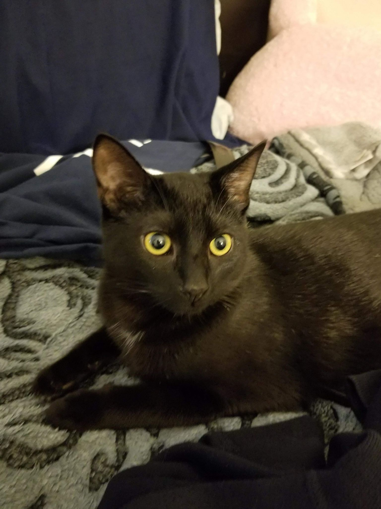

# Introduction 

My name is Philip Kim and I am a first year graduate student studying Biostatistics at Columbia University Mailman School of Public Health. My career goals include working for the National Center for Health Statistics and the CDC. In terms of personal life, this is my first time living outside of California and I have a cat named Loki. 

## Here's Loki

## Academic/professional Experience

Click [here](resume.html) to access my academic and professional experience. 
